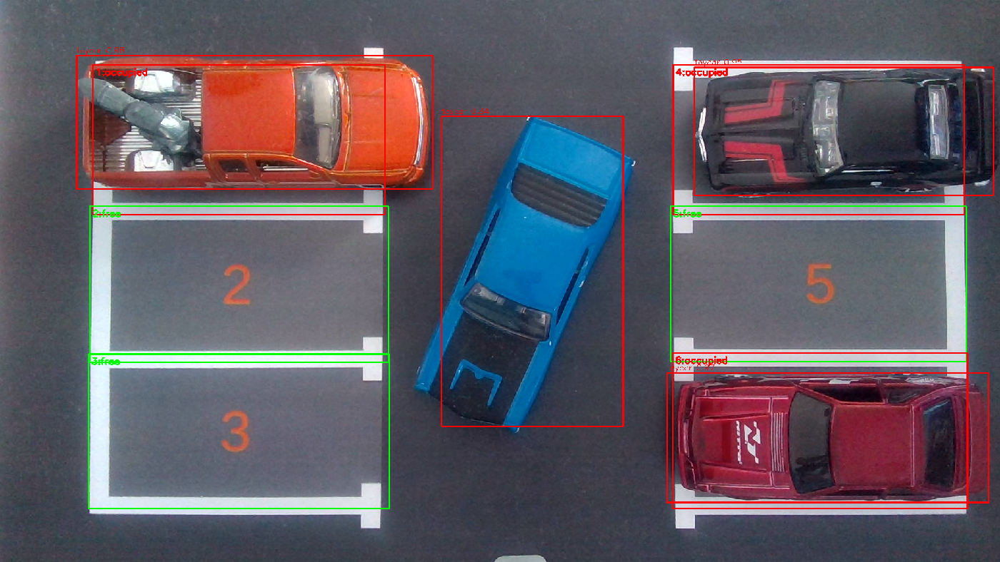
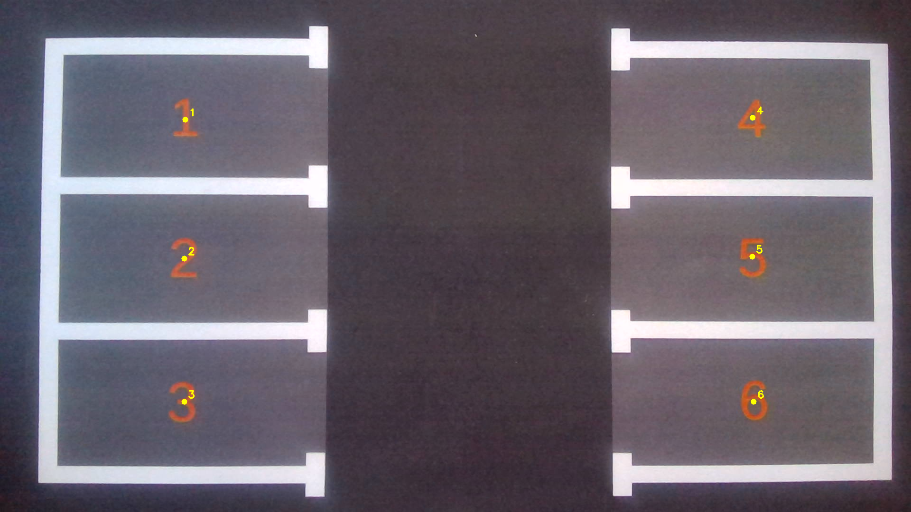
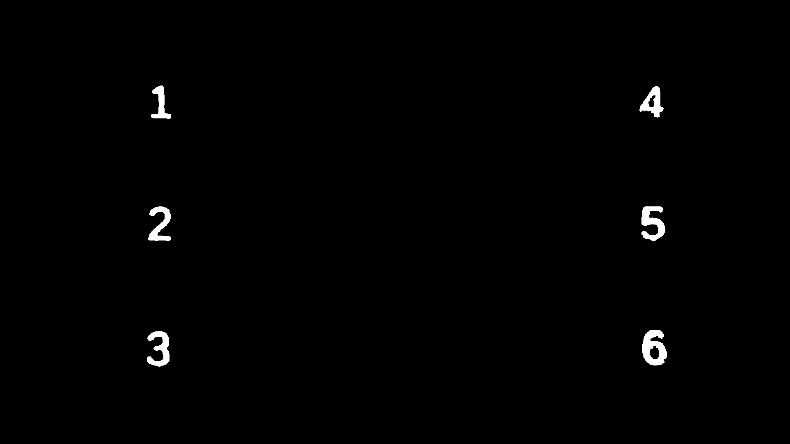
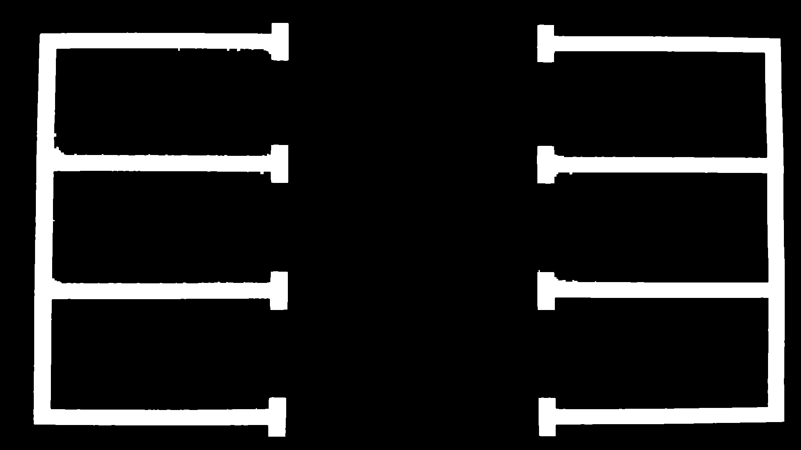
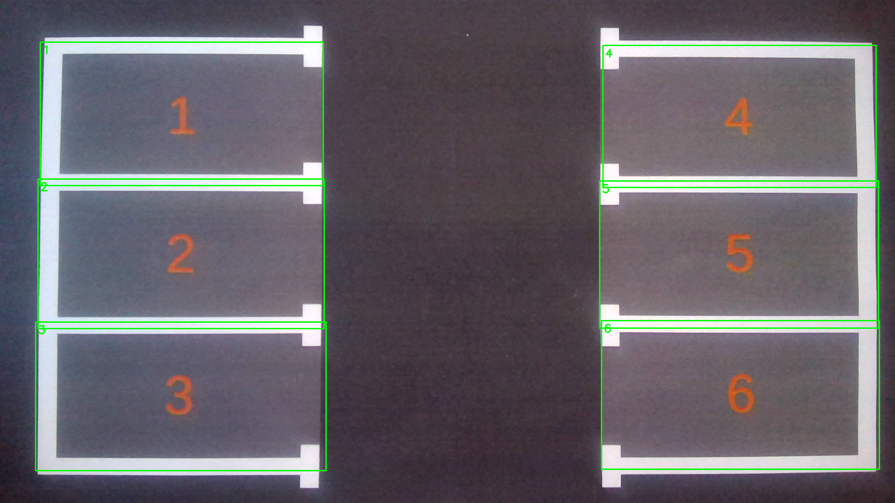

# Parking spot detection with OpenCV and YOLOv8

A computer vision project I built between November 2025 and January 2026. A camera looks down at a small parking lot model with 6 spots and some toy cars, and the program shows live which spots are free and which are taken.



Green rectangles are free spots, red ones are occupied, and the red boxes are the cars found by YOLO.

## How it works

**Finding the spots.** Each spot on the mat has an orange number and white lines around it. When the program starts, you press SPACE on the empty lot and it grabs one frame. The code finds the six orange numbers with an HSV color mask and numbers them by position, then scans from each number to the surrounding white lines to get a rectangle for every spot. The rectangles are saved to `rois.json`.

These are the debug images the calibration saves at each step:

<table>
  <tr>
    <td align="center"><br><sub>1. Orange numbers found</sub></td>
    <td align="center"><br><sub>2. Color mask for the numbers</sub></td>
  </tr>
  <tr>
    <td align="center"><br><sub>3. Mask for the white lines</sub></td>
    <td align="center"><br><sub>4. Final spot rectangles</sub></td>
  </tr>
</table>

**Detecting the cars.** Every camera frame goes through a YOLOv8n model that I fine-tuned on pictures of the toy cars. A spot counts as occupied when the center of a detected car falls inside its rectangle. The terminal only prints the spots when something changes.

Before switching to YOLO, I first tried a version without any training (`main.py`), which compares the color saturation of each spot with the empty lot. I kept it in the repo.

## Dataset and training

I took the training pictures myself with `capture_dataset.py` (169 frames with different cars and positions), prepared the dataset in Roboflow and fine-tuned YOLOv8n starting from the pretrained COCO weights. Training ran for 60 epochs on my laptop's CPU and took about 20 minutes. The trained weights are in `model/best.pt` and the training logs are in `runs_hotwheels/exp_169/`.

The dataset is also on [Roboflow Universe](https://universe.roboflow.com/universitatea-politehnica-bucuresti-cawaz/hotwheels-kfvpf/dataset/2).

## Running it

```
pip install -r requirements.txt
python main_yolo.py
```

You need a camera above the lot. `main_yolo.py` uses camera index 1, so change `CAM_INDEX` at the top of the file if yours is 0. Press SPACE to calibrate on the empty lot and q to quit.

Other scripts:

- `main.py` - the version without YOLO (needs a `rois.json` from the calibration; c to calibrate, q to quit)
- `capture_dataset.py` - takes pictures for the dataset (s to save a frame)
- `roi_detection/compute_rois.py` - only the spot calibration, works with the camera or an image path
- `inference/yolo_full_frame_debug.py` - shows the raw detections of the model

To train again:

```
yolo detect train model=yolov8n.pt data=data_hotwheels_yolo/data.yaml epochs=60 imgsz=640 batch=5 device=cpu
```

## What I'd like to improve

- Train on more varied pictures (different lighting and camera angles)
- Smooth the results over a few frames so the spots don't flicker
- Support any number of spots and cameras that aren't straight above the lot
